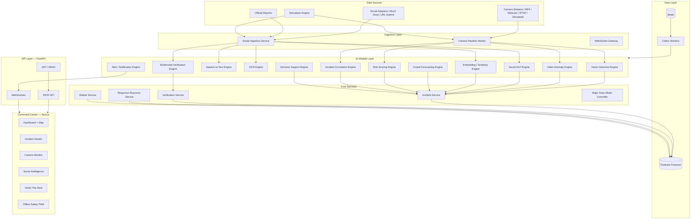
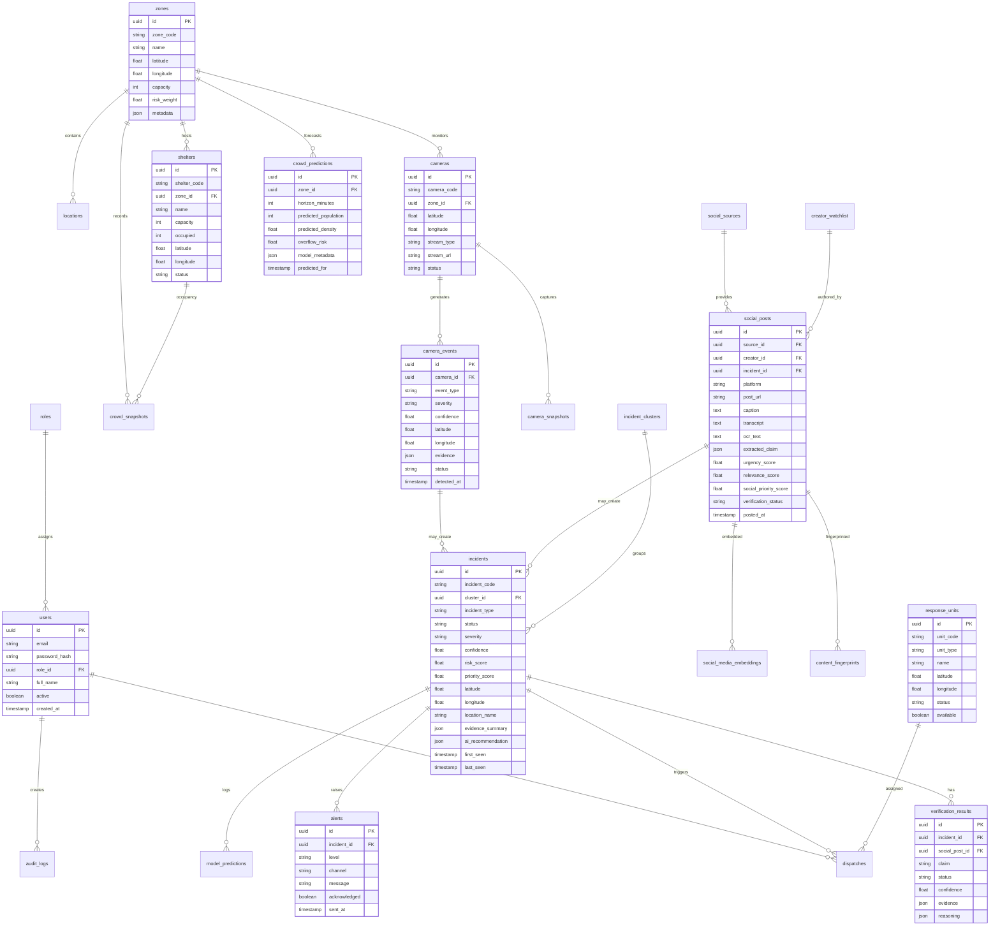

# KumbhRakshak — System Architecture

## A. Architecture Diagram

## B. Database ER Design

## C. Service / Module Breakdown

| Module | Package | Responsibility |
|--------|---------|----------------|
| A — Vision Detection | `ai/vision/detector.py` | YOLO person/object detection |
| B — Video Anomaly | `ai/vision/anomaly.py` | Motion, tracking, event classification |
| C — Speech-to-Text | `ai/speech/whisper_service.py` | Hindi/Marathi/English transcription |
| D — OCR | `ai/ocr/ocr_service.py` | Sign/board text extraction |
| E — Social NLP | `ai/nlp/social_engine.py` | Claim/incident extraction |
| F — Multimodal Verification | `ai/vision/multimodal.py` | VLM frame analysis (abstracted) |
| G — Embedding / Similarity | `ai/embeddings/engine.py` | sentence-transformers + pgvector |
| H — Crowd Forecasting | `ai/forecasting/crowd_forecast.py` | XGBoost/statistical forecasting |
| I — Risk Scoring | `ai/risk/scoring_engine.py` | Deterministic explainable scoring |
| J — Incident Correlation | `services/correlation_service.py` | Cross-camera + social clustering |
| K — Decision Support | `ai/nlp/decision_support.py` | LLM recommendations from facts |
| L — Alert Engine | `services/alert_service.py` | Multi-channel alert dispatch |

| Service | Package | Responsibility |
|---------|---------|----------------|
| Camera Service | `services/camera_service.py` | Camera CRUD, stream management |
| Event Service | `services/event_service.py` | Camera event processing pipeline |
| Social Service | `services/social_service.py` | Ingestion, analysis orchestration |
| Incident Service | `services/incident_service.py` | Incident lifecycle |
| Verification Service | `services/verification_service.py` | Ground-truth comparison |
| Response Service | `services/response_service.py` | Nearest unit calculation |
| Shelter Service | `services/shelter_service.py` | Occupancy & overflow |
| Simulation Service | `simulation/engine.py` | Major Snan timeline demo |
| WebSocket Manager | `core/websocket_manager.py` | Real-time broadcast |

## D. Model Selection Table

| Task | Model / Library | Provider | Hackathon Mode |
|------|-----------------|----------|----------------|
| Object detection | YOLOv8n (Ultralytics) | Local | Real (lightweight) |
| Object tracking | ByteTrack / centroid tracker | Local | Real |
| Motion analysis | OpenCV optical flow | Local | Real |
| Fire/smoke | Color/HSV heuristic + YOLO | Local | Heuristic MVP |
| Person-down | Pose/ bbox aspect ratio + temporal | Local | Heuristic MVP |
| Crowd density | Person count / frame area | Local | Real |
| Speech-to-text | faster-whisper base | Local | Real (optional GPU) |
| OCR | EasyOCR | Local | Real |
| NLP classification | OpenAI GPT-4o-mini / MockLLM | API / Local | Mock without key |
| Multimodal VLM | OpenAI GPT-4o / MockVision | API / Local | Mock without key |
| Embeddings | all-MiniLM-L6-v2 | Local | Real |
| Vector search | In-app cosine similarity | Firebase JSON embeddings | Real |
| Forecasting | XGBoost + simulated history | Local | Real |
| Risk scoring | Weighted deterministic Python | Local | Real |
| Recycled content | perceptual hash (imagehash) | Local | Real |

## E. API List

### Auth
- `POST /api/auth/login` — JWT login
- `POST /api/auth/register` — Admin user creation
- `GET /api/auth/me` — Current user

### Cameras
- `GET /api/cameras` — List cameras (filter by zone/status)
- `GET /api/cameras/{camera_id}` — Camera detail
- `POST /api/cameras/events` — Ingest camera event
- `GET /api/cameras/{camera_id}/events` — Event history
- `POST /api/cameras/{camera_id}/analyze` — Trigger frame analysis

### Social
- `POST /api/social/ingest` — Ingest post
- `POST /api/social/analyze` — Analyze post content
- `GET /api/social/posts` — List posts (filters)
- `GET /api/social/posts/{id}` — Post detail
- `POST /api/social/verify-url` — Verify This Reel feature

### Incidents
- `POST /api/incidents` — Create incident
- `GET /api/incidents` — List incidents
- `GET /api/incidents/{id}` — Incident detail
- `PATCH /api/incidents/{id}` — Update status

### Verification
- `POST /api/verification/analyze` — Run verification
- `GET /api/verification/{id}` — Verification result

### Predictions
- `POST /api/predictions/run` — Run forecast
- `GET /api/predictions` — All predictions
- `GET /api/predictions/{zone_id}` — Zone forecast

### Response
- `GET /api/response-units` — List units
- `GET /api/response-units/nearest` — Nearest to lat/lng
- `POST /api/dispatch/recommend` — AI dispatch recommendation
- `POST /api/dispatch/confirm` — Human-confirmed dispatch

### Shelters
- `GET /api/shelters` — List shelters
- `GET /api/shelters/{id}` — Shelter detail

### Alerts
- `GET /api/alerts` — List alerts
- `POST /api/alerts` — Create alert

### Simulation
- `POST /api/simulation/start` — Start Major Snan sim
- `POST /api/simulation/stop` — Stop simulation
- `POST /api/simulation/reset` — Reset state
- `POST /api/simulation/inject-fire` — Inject fire event
- `POST /api/simulation/inject-crowd` — Inject crowd surge
- `POST /api/simulation/inject-accident` — Inject accident
- `POST /api/simulation/inject-social-claim` — Inject social claim
- `POST /api/simulation/inject-misinformation` — Inject false claim

### WebSockets
- `/ws/incidents` — Incident updates
- `/ws/cameras` — Camera events
- `/ws/alerts` — Alert stream
- `/ws/crowd` — Crowd metrics

### Health
- `GET /health` — System health
- `GET /health/ai` — AI module status
- `GET /health/db` — Database status

## F. Development Roadmap

| Phase | Scope | Deliverables |
|-------|-------|--------------|
| 1 | Foundation | FastAPI app, Firebase Firestore, JWT auth, Next.js shell |
| 2 | Geo entities | Zones, cameras, shelters, units, Mapbox dashboard |
| 3 | Vision pipeline | Simulated cameras, YOLO, crowd metrics, events |
| 4 | Event detectors | Fire/smoke, person-down, accident, security |
| 5 | Social intel | Adapters, mock feed, NLP, STT, OCR, location |
| 6 | Verification | Embeddings, clustering, ground-truth, recycled |
| 7 | Intelligence | Risk engine, forecasting, shelter pressure |
| 8 | Real-time | Decision support, alerts, WebSockets |
| 9 | Demo | Major Snan simulation with UI controls |
| 10 | Polish | Tests, Docker, docs, PWA offline mode |
